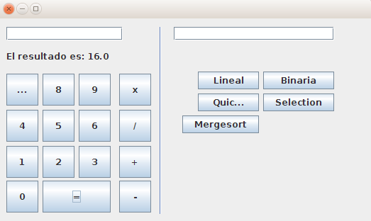

# Exercise 2

Second exercise, creating a basic calculator using sockets and Java Swing. 

For further information about the practices and technologies check [RootReadme] (../../../../../README.md)

# How does it work?

Using a Swing interface You can work with simple operations (sum, subtract, divide, multiply) with two numbers.

Also some search and sorting algorithms has been implemented. If you would like to use a search algorithm you need to follow the next syntax:

```
elementToBeFound;item1,item2,item3,...,itemN
```

# Pictures




# How to run it?

On repository root folder, we just need to execute the next commands.

Server: 
```
./gradlew Ex2_ServerInstance
```

Client:
```
./gradlew Ex2_ClientInstance
```

# Extra information.

Any doubts about it! Try to contact me! [Twitter](http://twitter.com/jresendiz27)