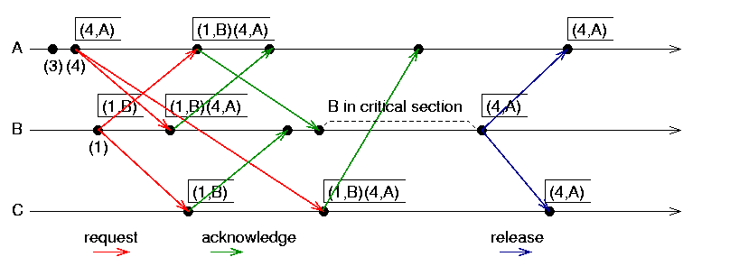
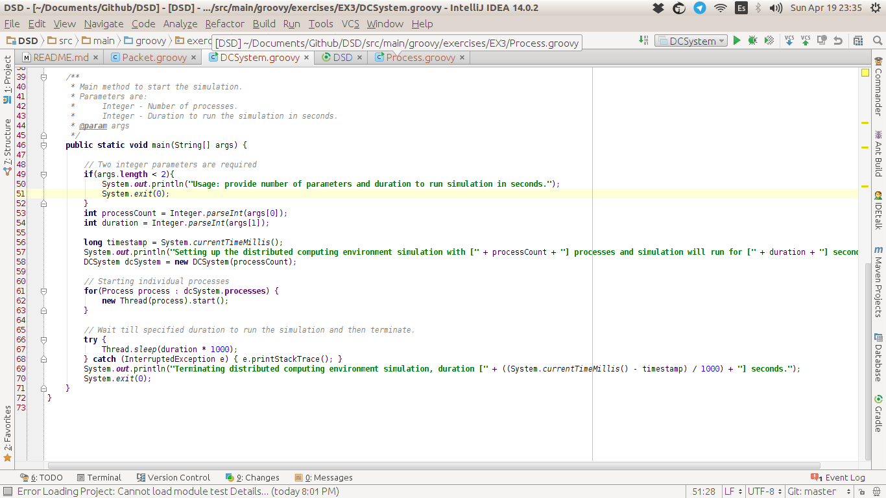
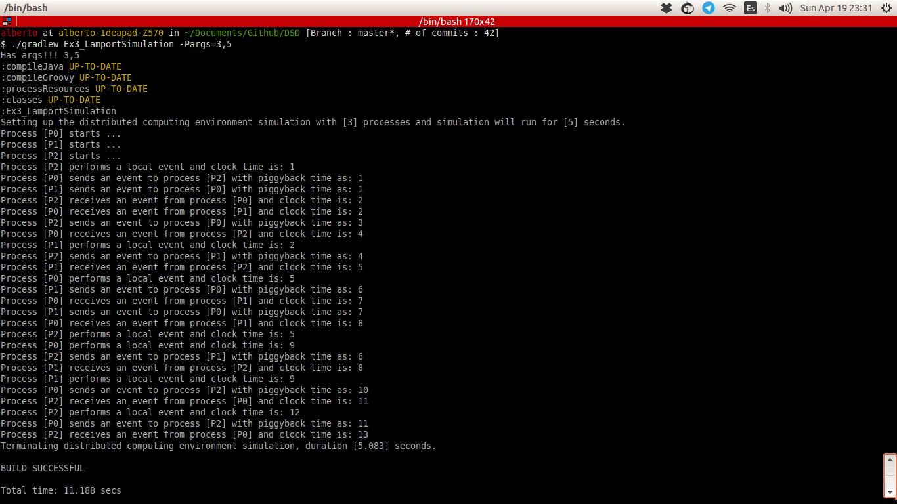

# Exercise 3

Exercise 3 Lamport simulation. 

For further information about the practices and technologies check [RootReadme] (../../../../../README.md)

# What does it do?
 
 **Lamport algorithm** is a connection based algorithm for mutual exclusion on a distributed system.
 This algorithm assumes messages are delivered in FIFO order between the pairs of sites/nodes.
 It's not based on tokes and adds a timestamp to each request, requests with lower timestamps take priority over
 the ones with higher.
 Each site/node maintains a queue of pairs *(timestamp,site)*, ordered by timestamp.
 
 Here's a image about the algorithm.
 

# How does it work?

Implementing some threads and simulating process, we can send information between them and simulate how Lamport's algorithm
tries to fix the problem of synchronization.
 

To execute the program you'll need to run the next gradle task

```
$./gradlew Ex3_LamportSimulation -Pargs=<NumberOfProcesses>,<RunningTimeInSeconds>
```

# Pictures




# Extra information.

Any doubts about it! Try to contact me! [Twitter](http://twitter.com/jresendiz27)